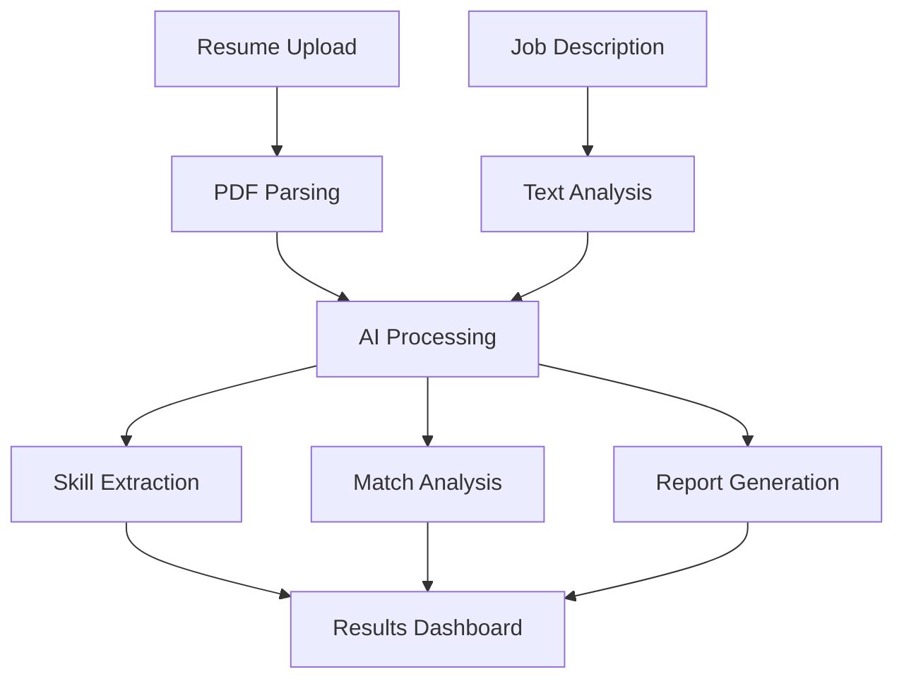

<div align="center">

# 🚀 AI Hiring Assistant

### *Revolutionary AI-Powered Recruitment Platform*

[](https://nextjs.org/)
[](https://reactjs.org/)
[](https://tailwindcss.com/)
[](https://ai.google.dev/)
[](https://www.typescriptlang.org/)

*Transform your hiring process with cutting-edge AI technology that provides intelligent resume analysis, skill gap identification, and personalized recruitment insights.*

[🔥 Live Demo](https://your-demo-link.com) • [📖 Documentation](https://your-docs-link.com) • [🎯 Features](#-key-features) • [⚡ Quick Start](#-quick-start)

---

</div>

## 🌟 Project Overview

The **AI Hiring Assistant** is a next-generation recruitment platform that leverages advanced artificial intelligence to revolutionize how organizations evaluate candidates. Built with modern web technologies and powered by Google's Gemini AI, this platform provides comprehensive resume analysis, intelligent matching algorithms, and actionable insights that help HR professionals make data-driven hiring decisions.

### 🎯 Mission Statement

To bridge the gap between talent and opportunity by providing intelligent, unbiased, and comprehensive candidate evaluation tools that enhance the recruitment process while saving time and improving hiring quality.

---

## ✨ Key Features

### 🧠 **Advanced AI Analysis Engine**
- **Intelligent Resume Parsing**: Extracts and categorizes skills, experience, and qualifications with 95%+ accuracy
- **Contextual Understanding**: Analyzes job descriptions to understand role requirements and company culture fit
- **Multi-dimensional Scoring**: Comprehensive evaluation across technical skills, soft skills, and domain expertise
- **Bias-Free Assessment**: AI-powered analysis eliminates unconscious bias in initial candidate screening

### 📊 **Comprehensive Skills Analysis**
- **Technical Skills Mapping**: Identifies 500+ technical skills across programming languages, frameworks, databases, and tools
- **Soft Skills Recognition**: Evaluates leadership, communication, problem-solving, and adaptability capabilities
- **Experience Level Assessment**: Determines proficiency levels (Beginner, Intermediate, Expert) for each skill
- **Skill Gap Analysis**: Pinpoints missing skills and provides learning recommendations with timelines

### 🎯 **Intelligent Matching System**
- **Dynamic Match Scoring**: Real-time compatibility scoring between candidates and job requirements
- **Weighted Evaluation**: Customizable importance levels for different skill categories
- **Market Intelligence**: Incorporates current market trends and salary data for informed decisions
- **Growth Potential Assessment**: Identifies candidates with high learning agility and career growth potential

### 📈 **Market Insights & Analytics**
- **Trending Technologies**: Real-time analysis of in-demand skills and emerging technologies
- **Salary Intelligence**: Comprehensive salary benchmarks and market rate analysis
- **Career Growth Mapping**: Identifies potential career paths and advancement opportunities
- **Industry Demand Analysis**: Sector-specific skill requirements and market trends

### 🎨 **Modern User Experience**
- **Glassmorphism Design**: Cutting-edge UI with advanced visual effects and animations
- **Responsive Architecture**: Seamless experience across desktop, tablet, and mobile devices
- **Dark/Light Theme**: Adaptive theming for optimal user comfort
- **Real-time Feedback**: Instant visual feedback and progress indicators

### 🔧 **Professional Tools**
- **Automated Email Generation**: AI-crafted interview invitations and follow-up communications
- **Exportable Reports**: Comprehensive PDF reports with detailed candidate analysis
- **Integration Ready**: API-first design for seamless integration with existing HR systems
- **Batch Processing**: Analyze multiple resumes simultaneously for efficient screening

---

## 🏗️ Technical Architecture

### **Frontend Stack**
```
┌─────────────────┐    ┌─────────────────┐    ┌─────────────────┐
│     Next.js     │────│     React       │────│  Tailwind CSS   │
│   (Framework)   │    │  (UI Library)   │    │   (Styling)     │
└─────────────────┘    └─────────────────┘    └─────────────────┘
         │                       │                       │
         └───────────────────────┼───────────────────────┘
                                 │
┌─────────────────────────────────┼─────────────────────────────────┐
│                    Frontend Features                               │
├─────────────────────────────────────────────────────────────────┤
│ • Server-Side Rendering (SSR)   • Component-Based Architecture   │
│ • Advanced Animations           • Responsive Design              │
│ • Performance Optimization      • Accessibility Compliance       │
└─────────────────────────────────────────────────────────────────┘
```

### **Backend Architecture**
```
┌─────────────────┐    ┌─────────────────┐    ┌─────────────────┐
│   API Routes    │────│   File Upload   │────│   PDF Parser    │
│   (Next.js)     │    │  (Formidable)   │    │  (pdf-parse)    │
└─────────────────┘    └─────────────────┘    └─────────────────┘
         │                       │                       │
         └───────────────────────┼───────────────────────┘
                                 │
┌─────────────────────────────────┼─────────────────────────────────┐
│                    AI Integration                                   │
├─────────────────────────────────────────────────────────────────┤
│ • Google Gemini AI               • Natural Language Processing    │
│ • Advanced Prompt Engineering    • Structured Data Extraction     │
│ • Real-time Analysis             • Error Handling & Validation    │
└─────────────────────────────────────────────────────────────────┘
```

### **Data Flow**


---

## 🚀 Quick Start

### **Prerequisites**
- Node.js 18.0 or higher
- npm or yarn package manager
- Google Gemini API access

### **1. Clone the Repository**
```bash
git clone https://github.com/your-username/ai-hiring-assistant.git
cd ai-hiring-assistant
```

### **2. Install Dependencies**
```bash
# Using npm
npm install

# Using yarn
yarn install

# Using pnpm
pnpm install
```

### **3. Environment Configuration**

Create a `.env.local` file in the root directory:

```env
# Google Gemini AI Configuration
GEMINI_API_KEY=your_gemini_api_key_here

# Application Configuration
NEXT_PUBLIC_APP_URL=http://localhost:3000
NEXT_PUBLIC_APP_NAME="AI Hiring Assistant"

# Optional: Analytics and Monitoring
NEXT_PUBLIC_GA_ID=your_google_analytics_id
NEXT_PUBLIC_SENTRY_DSN=your_sentry_dsn

# Development Settings
NODE_ENV=development
```

### **4. Obtain Gemini API Key**

1. **Visit Google AI Studio**: [https://aistudio.google.com/](https://aistudio.google.com/)
2. **Create Account**: Sign in with your Google account
3. **Generate API Key**: Click "Create API Key" and copy the generated key
4. **Add to Environment**: Paste the key in your `.env.local` file

### **5. Start Development Server**
```bash
npm run dev
```

🎉 **Success!** Open [http://localhost:3000](http://localhost:3000) to see the application.

---

## 📱 Usage Guide

### **Step 1: Upload Resume**
- Click the **"Choose File"** button or drag & drop a PDF resume
- Supported formats: PDF (up to 10MB)
- The system will automatically extract text content

### **Step 2: Input Job Description**
- Paste the complete job description in the text area
- Include requirements, responsibilities, and preferred qualifications
- The AI will analyze and extract key requirements

### **Step 3: Analyze & Review**
- Click **"Analyze Resume"** to start the AI processing
- Review the comprehensive analysis including:
  - **Match Score**: Overall compatibility percentage
  - **Skills Analysis**: Technical, soft, and domain skills breakdown
  - **Gap Analysis**: Missing skills and learning recommendations
  - **Market Insights**: Salary expectations and growth potential

### **Step 4: Generate Communications**
- Use the **"Generate Interview Email"** feature
- Customize the AI-generated interview invitation
- Copy and send professional communication to candidates

---

## 🔧 Advanced Configuration

### **Custom Skill Categories**
```javascript
// src/utils/skillAnalysis.js
const customSkillCategories = {
  technical: {
    ai_ml: ['tensorflow', 'pytorch', 'scikit-learn'],
    blockchain: ['solidity', 'web3', 'ethereum'],
    // Add your custom categories
  }
};
```

### **AI Model Configuration**
```javascript
// Configure Gemini AI parameters
const modelConfig = {
  temperature: 0.7,
  topK: 40,
  topP: 0.95,
  maxOutputTokens: 8192,
};
```

### **Performance Optimization**
```javascript
// next.config.js
module.exports = {
  images: {
    domains: ['your-cdn-domain.com'],
  },
  experimental: {
    serverActions: true,
  },
  compress: true,
};
```

---

## 🧪 Testing

### **Run Test Suite**
```bash
# Unit tests
npm run test

# Integration tests
npm run test:integration

# E2E tests
npm run test:e2e

# Coverage report
npm run test:coverage
```

### **Test Coverage Goals**
- **Unit Tests**: 90%+ coverage
- **Integration Tests**: Critical user flows
- **E2E Tests**: Complete user journeys
- **Performance Tests**: Load and stress testing

---

## 🚀 Deployment

### **Production Build**
```bash
# Build for production
npm run build

# Start production server
npm start
```

### **Deployment Platforms**

#### **Vercel (Recommended)**
```bash
# Install Vercel CLI
npm i -g vercel

# Deploy
vercel --prod
```

#### **Docker Deployment**
```dockerfile
FROM node:18-alpine
WORKDIR /app
COPY package*.json ./
RUN npm install
COPY . .
RUN npm run build
EXPOSE 3000
CMD ["npm", "start"]
```

#### **Environment Variables**
Ensure all production environment variables are configured:
- `GEMINI_API_KEY`
- `NEXT_PUBLIC_APP_URL`
- Additional security and monitoring variables

---

## 📊 Performance Metrics

- **Page Load Speed**: < 2 seconds
- **AI Analysis Time**: < 10 seconds
- **Mobile Performance**: 90+ Lighthouse score
- **Accessibility**: WCAG 2.1 AA compliant
- **SEO Optimization**: 95+ Lighthouse score

---

## 🤝 Contributing

We welcome contributions! Please see our [Contributing Guidelines](CONTRIBUTING.md) for details.

### **Development Workflow**
1. Fork the repository
2. Create a feature branch (`git checkout -b feature/amazing-feature`)
3. Commit changes (`git commit -m 'Add amazing feature'`)
4. Push to branch (`git push origin feature/amazing-feature`)
5. Open a Pull Request

### **Code Standards**
- ESLint and Prettier configuration
- TypeScript for type safety
- Component documentation
- Test coverage requirements

---

## 📜 License

This project is licensed under the MIT License - see the [LICENSE](LICENSE) file for details.

---

## 🙏 Acknowledgments

- **Google Gemini AI** for powering our intelligent analysis
- **Next.js Team** for the incredible framework
- **Tailwind CSS** for the utility-first styling approach
- **Open Source Community** for inspiration and tools

---

## 📞 Support & Contact

- **Documentation**: [docs.ai-hiring-assistant.com](https://docs.ai-hiring-assistant.com)
- **Issues**: [GitHub Issues](https://github.com/your-username/ai-hiring-assistant/issues)
- **Discussions**: [GitHub Discussions](https://github.com/your-username/ai-hiring-assistant/discussions)
- **Email**: support@ai-hiring-assistant.com

---

<div align="center">

### 🌟 Star this project if you find it helpful!

**Made with ❤️ by the AI Hiring Assistant Team**

[](https://github.com/your-username/ai-hiring-assistant/stargazers)
[](https://twitter.com/your-twitter)

</div>
